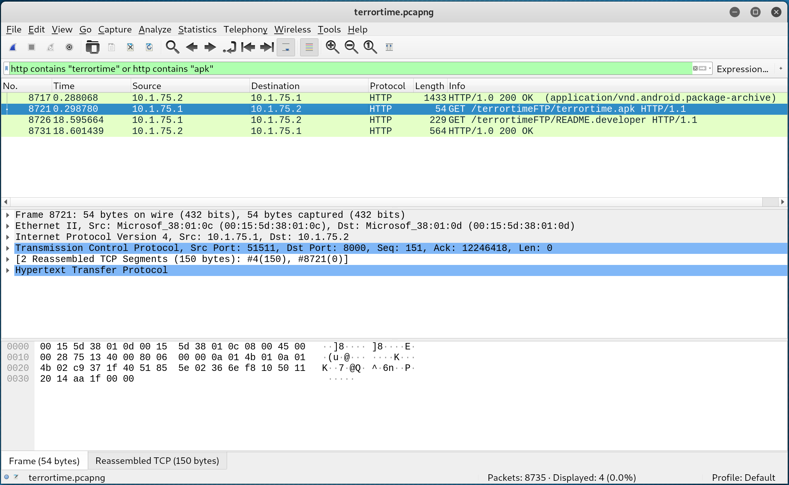

## Task 01 - Network Traffic Analysis

* Open [terrortime.pcapng](./terrortime.pcapng) in [wireshark](https://www.wireshark.org/download.html) application.
* Use filter box to filter the `HTTP` packets which have `terrortime` or `apk` keyword:



* There are 2 GETs packets `No. 8721` and `No. 8726` in the results that we need to inspect. By following HTTP stream (Right click on the packet and choose `Follow > HTTP stream`), we can confirm that they are what we are looking for ([terrortime.apk](./assets/terrortime.apk) file and the info of 2 [accounts](./assets/README.developer))
* To extract the files from the `pcap`, in Wireshark, go to `File > Export Objects > HTTP` and choose `Save all`
```shell
$ sha256sum terrortime.apk
72bca4770a10895aac253b4af65a9ee23feef9b6e9fa3f46496260bf00c416fe  terrortime.apk

$ cat README.developer | grep -i 'terrortime test account'
paris--vhost-1310@terrortime.app -- First Terrortime test account client id
edward--vhost-1310@terrortime.app -- Second Terrortime test account client id
ERADyCFZo8BY4g -- First Terrortime test account client secret
ogNYGhSMa1bgXq -- Second Terrortime test account client secret
```
